<div align="center">

# MARBLE

**Omnidirectional Amphibious Locomotion via Internal Mass Actuation**

[Niko Weaver](https://github.com/NikoWeaver)\*,
[Boxi Xia](https://boxixia.github.io/)\*,
[Li-Yu Lo](https://pattylo.github.io/)\*,
[Yuhao Huang](https://hyh2001.github.io/),
[Boyuan Chen](https://boyuanchen.com)

\* equal contribution

General Robotics Lab, Duke University

**[Paper (arXiv)](https://arxiv.org/abs/2609.27358)** &middot;
**[Project page](https://generalroboticslab.com/MARBLE)** &middot;
**[Operations runbook](docs/OPERATIONS.md)** &middot;
**[Setup](docs/SETUP.md)** &middot;
**[Policies](policies/README.md)**

[](https://arxiv.org/abs/2609.27358)
[](LICENSE)


</div>

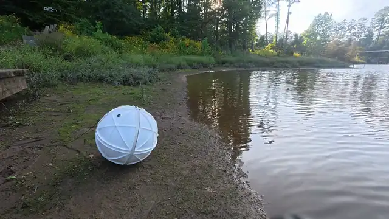

<div align="center"><i>Land-to-water entry, real time.</i></div>

MARBLE is a sealed, omnidirectional amphibious robot. Three orthogonal sliders shift internal
masses to roll the spherical shell. The shell is the ground contact, buoyant hull and fin mount,
so one mechanism works on land and water with no reconfiguration.

This repository is the onboard control stack. An Orange Pi runs a 100 Hz loop that reads the
IMU, runs the geometric or learned controller, and sends slider targets over USB serial to a
XIAO nRF52840 CAN bridge driving three GL40 II motors. Bridge firmware, calibration tools and
checkpoints are included, and [`simulation/`](simulation/README.md) trains and replays the deployed
policies in MuJoCo. The code uses the working name `ballbot`.

> **Safety.** Restrain the robot for any first run, and keep a power cutoff within reach: no
> software stop cuts power. `X` latches the E-stop. The controller does not home by default; it
> arms at the pose the drivers report and steps the sliders to centre from it. During `--home`,
> only Ctrl+C stops it. See [safety](docs/OPERATIONS.md#safety),
> [homing](docs/OPERATIONS.md#homing) and [automatic stops](docs/OPERATIONS.md#automatic-stops).

## MARBLE on hardware

<table>
<tr>
<td width="33%">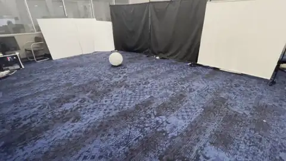</td>
<td width="33%">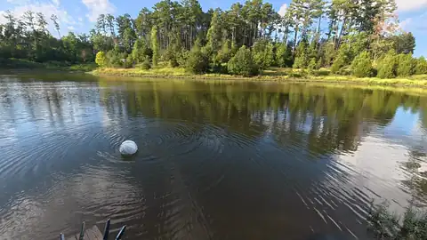</td>
<td width="33%">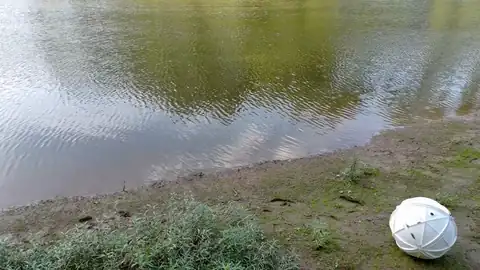</td>
</tr>
<tr>
<td><b>Terrestrial rolling, 1.5x speed.</b> The shell is the ground contact.</td>
<td><b>Water-surface propulsion, 2x speed.</b> Passive fins turn shell rotation into thrust.</td>
<td><b>Land-water transition, 3x speed.</b> One run, no change to the robot.</td>
</tr>
</table>

Planar trajectories of the paper's representative trials (Fig. 4). Colour is time, the circle
marks the start and the cross the end.

<table>
<tr>
<td width="33%">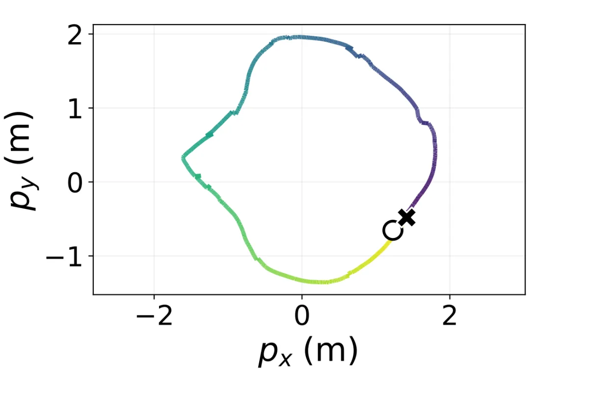</td>
<td width="33%">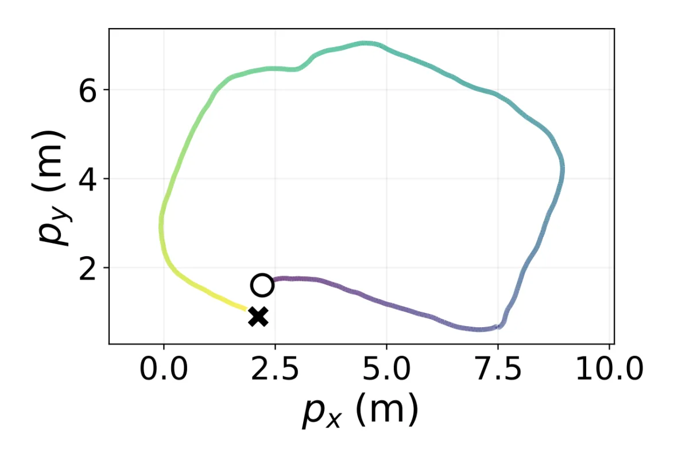</td>
<td width="33%">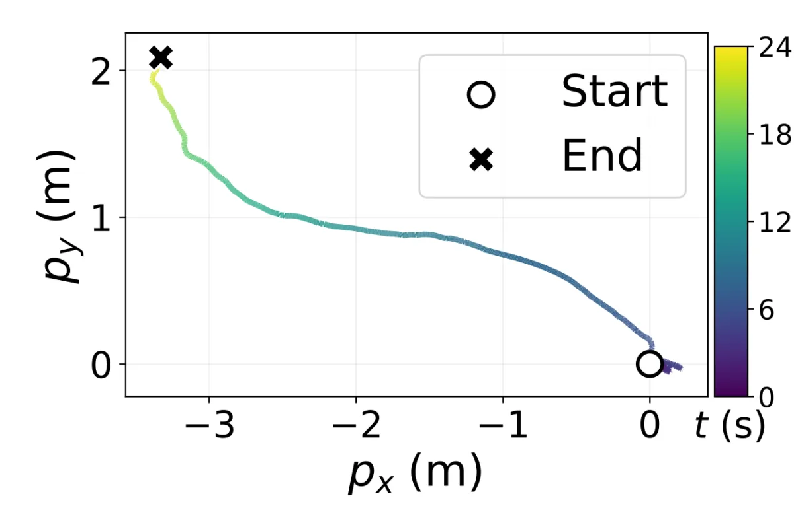</td>
</tr>
</table>

| | Terrestrial | Aquatic | Transition |
| --- | ---: | ---: | ---: |
| Distance | 10.60 m | 5.24 m | 5.21 m |
| Duration | 14.00 s | 14.00 s | 23.93 s |
| Mean speed | 0.745 ± 0.163 m/s | 0.375 ± 0.059 m/s | 0.215 ± 0.146 m/s |
| Max speed | 1.025 m/s | 0.488 m/s | 0.840 m/s |

The aquatic figures cover a 14 s window taken mid-trial, not the whole run.

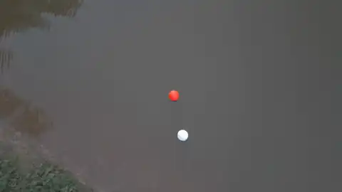

**Obstacle interaction, aerial view, 4x speed.**

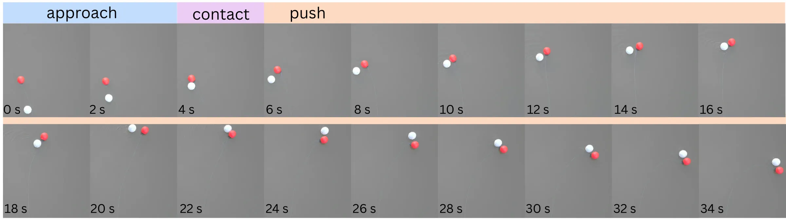

Fig. 6 time-lapse, 0 to 34 s: approach, shell contact, continued pushing. MARBLE is white, the
buoy red.

## Locomotion and controllers

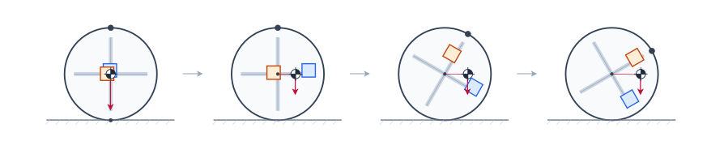

Moving the slider masses offsets the centre of gravity from the shell centre, and the moment
about the ground contact rolls the shell. The sliders rotate with the shell, so both controllers
read the IMU orientation every step.

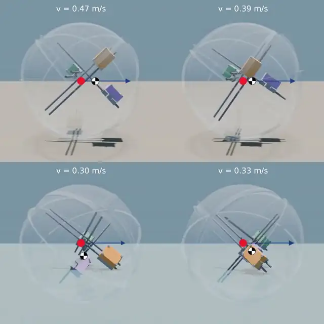

MuJoCo rollouts at a commanded 0.5 m/s, real time. Rows: ground, water. Columns: geometric,
learned. The sliding masses have one colour per rail; the quartered circle is their centre of
gravity, the red dot the shell centre and the blue arrow the heading.

| Paper | Code | How to run it |
| --- | --- | --- |
| Geometric controller | `HeuristicPolicy` in [`src/ballbot_runtime.py`](src/ballbot_runtime.py) | `--policy heuristic` (`run.sh` option 4) |
| Learned controller | `TrainedPolicy` in [`src/ballbot_runtime.py`](src/ballbot_runtime.py) | `--policy trained --policy-path policies/<name>/policy_deployed.pt` (`run.sh` option 5) |

The geometric controller computes slider targets from the IMU orientation on every 100 Hz tick.
The learned controller is a 50 Hz TorchScript policy that maps the last three 23-value
observation frames to three slider targets.

The paper compares both controllers on hardware under operator velocity commands in every
direction (Fig. 5). Velocities come from differentiated camera trajectories, drawn from a
common origin with the same axes and colour scale in both panels.

<table>
<tr>
<td width="50%">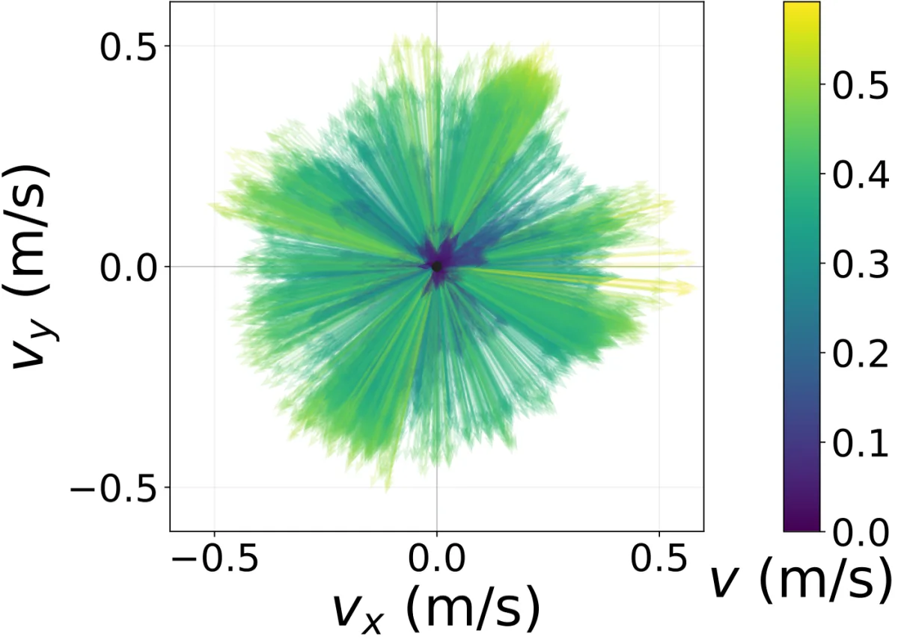</td>
<td width="50%">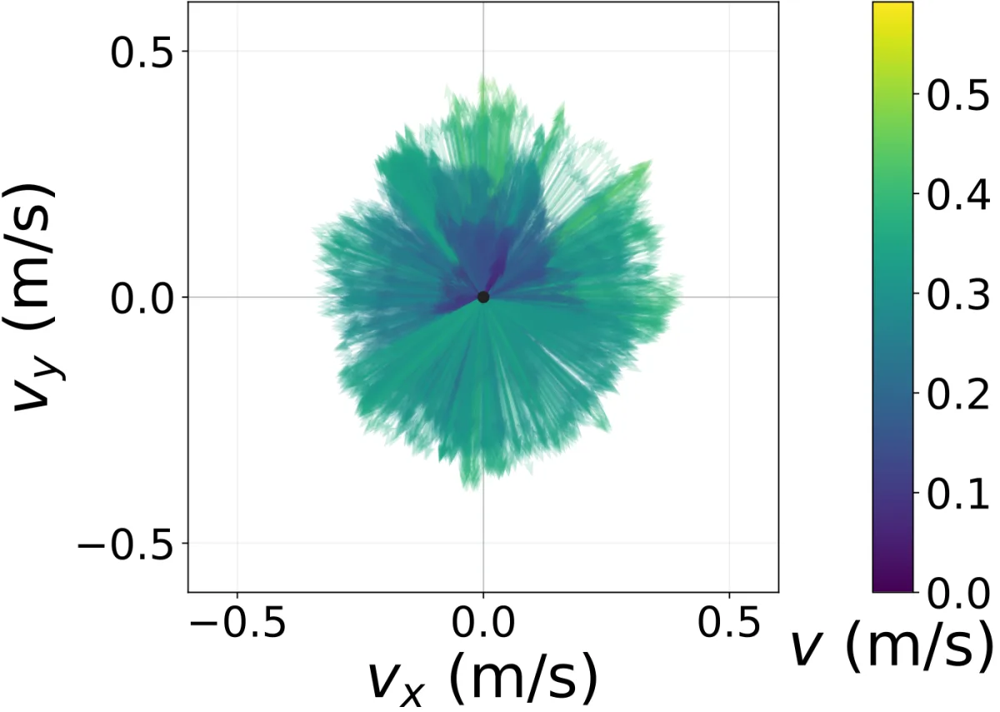</td>
</tr>
<tr>
<td><b>Learned controller.</b></td>
<td><b>Geometric controller.</b></td>
</tr>
</table>

| | Learned | Geometric |
| --- | ---: | ---: |
| Mean speed | 0.348 ± 0.114 m/s | 0.252 ± 0.088 m/s |
| Max speed | 0.592 m/s | 0.461 m/s |
| Distance covered | 94.10 m | 63.67 m |
| Duration | 270.37 s | 252.20 s |
| Velocity samples | 7,568 | 7,568 |

## Hardware

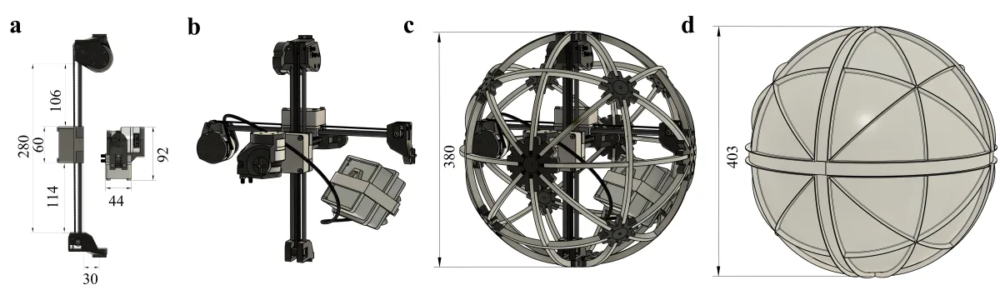

(a) Linear mass-slider module. (b) Three orthogonal sliders and the electronics capsule.
(c) Internal frame without the shell. (d) Complete robot with sealed shell and passive fins.
Dimensions in mm; the 403 mm in (d) is the 387 mm shell plus two 8 mm fins. The full
assembly is in [`cad/MarbleASM.step.zip`](cad/MarbleASM.step.zip) (zipped STEP).

| | |
| --- | --- |
| Outer diameter | 387 mm |
| Shell mass | 1.05 kg |
| Fin height | 8 mm |
| Mass sliders | 3 × 700 g |
| Slider stroke | 220 mm |
| Motors | 3 × CubeMars GL40 II, CAN IDs `0x08`, `0x07`, `0x06`, position-velocity mode |
| Motor bridge | Seeed XIAO nRF52840 Sense + MCP2515; USB serial 115200 baud, CAN 1 Mbit/s |
| IMU | SYD Dynamics TransducerM TM171, USB serial 4 Mbaud, EasyProfile protocol |
| Onboard computer | Orange Pi, aarch64 Linux, Python 3.12 |
| Control rate | 100 Hz; learned policy 50 Hz |
| Battery | 4S LiPo, 16 V |
| Operator input | Keyboard over `ssh -t` |

## System diagram

```
 keyboard over ssh -t                  TM171 IMU, USB serial 4 Mbaud
          |                                        |
          +-------------------+--------------------+
                              v
 Orange Pi   run.sh -> src/ballbot_terminal.py, 100 Hz  -------> logs/*.msgpack
                              |
             HeuristicPolicy (every tick) | TrainedPolicy (50 Hz)
                              | slider targets
             MotorJointMapper: config/calibration.json, clamp 10-195 mm
                              | motor positions
             GLMotorController
                              | USB serial, 115200 baud
 XIAO nRF52840 Sense -> MCP2515 (SPI)
                              | CAN, 1 Mbit/s
          GL40 II 0x08    GL40 II 0x07    GL40 II 0x06
```

## Quick start

```bash
# On the Orange Pi
micromamba create -n py312 python=3.12 -y && micromamba activate py312
export BALLBOT_PYTHON="$(command -v python)"
pip install torch --index-url https://download.pytorch.org/whl/cpu
VCPKG_ROOT=/path/to/vcpkg ./scripts/prepare_orangepi.sh

# Flash xiao_can/xiao_can_bridge/ with motor power off, then
python scripts/verify_xiao_firmware.py

# Over ssh -t, robot restrained: option 3, then option 4 (geometric) or 5 (learned)
./run.sh
```

[`docs/SETUP.md`](docs/SETUP.md) has the details; the committed calibration backup's motor IDs
were remapped, not measured, so run option 3 before the first control run. Read
[`docs/OPERATIONS.md`](docs/OPERATIONS.md) before driving, and always pass `--policy-path` when
launching `src/ballbot_terminal.py` directly: its default points at a retired checkpoint.

To play the deployed policies in simulation instead (desktop with an NVIDIA GPU):

```bash
micromamba create -n marble-sim python=3.12 -y && micromamba activate marble-sim
pip install -r simulation/requirements.txt
cd simulation
python mj_envs/run.py play --task BallbotVelComplexFlatDRLatency   # land
python mj_envs/run.py play --task BallbotVelRingCageComplexDR      # water
```

The shipped checkpoints in `policies/` load automatically; see
[`simulation/README.md`](simulation/README.md) for viewer keys, training and export.

## Documentation

| File | Covers |
| --- | --- |
| [`docs/OPERATIONS.md`](docs/OPERATIONS.md) | Running the robot: menu, keys, flags, automatic stops, logs |
| [`docs/SETUP.md`](docs/SETUP.md) | Install, build, serial ports, flashing, calibration |
| [`docs/validation.md`](docs/validation.md) | Bring-up checklist for a new or rebuilt robot |
| [`docs/DEVELOPING.md`](docs/DEVELOPING.md) | Code map, controller interfaces, observation layout, offline checks |
| [`docs/FLASH_XIAO.md`](docs/FLASH_XIAO.md) | Flashing the bridge firmware |
| [`policies/README.md`](policies/README.md) | Checkpoint catalogue |
| [`simulation/README.md`](simulation/README.md) | Training and playing the policies in simulation |
| [`hardware_bindings/README.md`](hardware_bindings/README.md) | IMU binding |
| [`PROVENANCE.md`](PROVENANCE.md) | Release sources, removed material, third-party code |

## Repository

```
run.sh               operator menu
src/                 control loop, controllers, motor mapping
xiao_can/            GL40 II driver and bridge firmware
hardware_bindings/   C++/nanobind IMU binding
scripts/             calibration, homing, bring-up, offline checks
config/              Python requirements, calibration backup
policies/            TorchScript checkpoints
simulation/          MuJoCo training and playback of the deployed policies
cad/                 STEP assembly of the robot (zipped)
docs/                runbook, setup, developer guide, checklist
media/               figures and clips in this README
CMakeLists.txt       IMU binding build
```

## Provenance and licence

This is a fresh-history release; [`PROVENANCE.md`](PROVENANCE.md) records its sources. The code
is licensed under Apache-2.0 ([`LICENSE`](LICENSE)). The EasyProfile SDK under
`hardware_bindings/imu/EasyProfile/` is BSD-2-Clause; see its
[`NOTICE.md`](hardware_bindings/imu/EasyProfile/NOTICE.md).

## Citation

```bibtex
@misc{weaver2026omnidirectionalamphibiouslocomotion,
      title={Omnidirectional Amphibious Locomotion via Internal Mass Actuation},
      author={Niko Weaver and Boxi Xia and Li-Yu Lo and Yuhao Huang and Boyuan Chen},
      year={2026},
      eprint={2609.27358},
      archivePrefix={arXiv},
      primaryClass={cs.RO},
      url={https://arxiv.org/abs/2609.27358},
}
```

## Acknowledgements

This work was conducted at the General Robotics Lab, Duke University. This work is supported by
DARPA FoundSci program under award HR00112490372, DARPA TIAMAT program under award
HR00112490419, ARO under award W911NF2410405, ARL STRONG program under awards W911NF2320182,
W911NF2220113, and W911NF242021.
